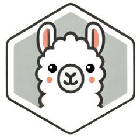

<!-- README.md is generated from README.Rmd. Please edit that file -->

```{r, include = FALSE}
knitr::opts_chunk$set(
  collapse = TRUE,
  comment = "#>",
  fig.path = "man/figures/README-",
  out.width = "100%"
)
```

# ollamar <a href="https://hauselin.github.io/ollama-r/"></a>

<!-- badges: start -->
[](https://CRAN.R-project.org/package=ollamar)
[](https://github.com/hauselin/ollama-r/actions/workflows/R-CMD-check.yaml)
[](https://cran.r-project.org/package=ollamar)
<!-- badges: end -->

The [Ollama R library](https://hauselin.github.io/ollama-r/) is the easiest way to integrate R with [Ollama](https://ollama.com/), which lets you run language models locally on your own machine. 

The library also makes it easy to work with data structures (e.g., conversational/chat histories) that are standard for different LLMs (such as those provided by OpenAI and Anthropic). It also lets you specify different output formats (e.g., dataframes, text/vector, lists) that best suit your need, allowing easy integration with other libraries/tools and parallelization via the `httr2` library.

To use this R library, ensure the [Ollama](https://ollama.com) app is installed. Ollama can use GPUs for accelerating LLM inference. See [Ollama GPU documentation](https://github.com/ollama/ollama/blob/main/docs/gpu.md) for more information.

See [Ollama's Github page](https://github.com/ollama/ollama) for more information. This library uses the [Ollama REST API (see documentation for details)](https://github.com/ollama/ollama/blob/main/docs/api.md) and was last tested on v0.5.4.

> Note: You should have at least 8 GB of RAM available to run the 7B models, 16 GB to run the 13B models, and 32 GB to run the 33B models.

## Ollama R vs Ollama Python/JS

This library has been inspired by the official [Ollama Python](https://github.com/ollama/ollama-python) and [Ollama JavaScript](https://github.com/ollama/ollama-js) libraries. If you're coming from Python or JavaScript, you should feel right at home. Alternatively, if you plan to use Ollama with Python or JavaScript, using this R library will help you understand the Python/JavaScript libraries as well.

## Installation

1. Download and install the [Ollama](https://ollama.com) app.

- [macOS](https://ollama.com/download/Ollama-darwin.zip)
- [Windows preview](https://ollama.com/download/OllamaSetup.exe)
- Linux: `curl -fsSL https://ollama.com/install.sh | sh`
- [Docker image](https://hub.docker.com/r/ollama/ollama)

2. Open/launch the Ollama app to start the local server. 

3. Install either the stable or latest/development version of `ollamar`.

Stable version: 

```{r eval=FALSE}
install.packages("ollamar")
```

For the latest/development version with more features/bug fixes (see latest changes [here](https://hauselin.github.io/ollama-r/news/index.html)), you can install it from GitHub using the `install_github` function from the `remotes` library. If it doesn't work or you don't have `remotes` library, please run `install.packages("remotes")` in R or RStudio before running the code below.

```{r eval=FALSE}
# install.packages("remotes")  # run this line if you don't have the remotes library
remotes::install_github("hauselin/ollamar")
```

## Example usage

Below is a basic demonstration of how to use the library. For details, see the [getting started vignette](https://hauselin.github.io/ollama-r/articles/ollamar.html) on our [main page](https://hauselin.github.io/ollama-r/).

`ollamar` uses the [`httr2` library](https://httr2.r-lib.org/index.html) to make HTTP requests to the Ollama server, so many functions in this library returns an `httr2_response` object by default. If the response object says `Status: 200 OK`, then the request was successful. 

```{r eval=FALSE}
library(ollamar)

test_connection()  # test connection to Ollama server
# if you see "Ollama local server not running or wrong server," Ollama app/server isn't running

# download a model
pull("llama3.1")  # download a model (equivalent bash code: ollama run llama3.1)

# generate a response/text based on a prompt; returns an httr2 response by default
resp <- generate("llama3.1", "tell me a 5-word story") 
resp

#' interpret httr2 response object
#' <httr2_response>
#' POST http://127.0.0.1:11434/api/generate  # endpoint
#' Status: 200 OK  # if successful, status code should be 200 OK
#' Content-Type: application/json
#' Body: In memory (414 bytes)

# get just the text from the response object
resp_process(resp, "text") 
# get the text as a tibble dataframe
resp_process(resp, "df") 

# alternatively, specify the output type when calling the function initially
txt <- generate("llama3.1", "tell me a 5-word story", output = "text")

# list available models (models you've pulled/downloaded)
list_models()  
                        name    size parameter_size quantization_level            modified
1               codegemma:7b    5 GB             9B               Q4_0 2024-07-27T23:44:10
2            llama3.1:latest  4.7 GB           8.0B               Q4_0 2024-07-31T07:44:33
```

## Citing `ollamar`

If you use this library, please cite [this paper](https://doi.org/10.31234/osf.io/zsrg5) using the following BibTeX entry:

```bibtex
@article{Lin2024Aug,
	author = {Lin, Hause and Safi, Tawab},
	title = {{ollamar: An R package for running large language models}},
	journal = {PsyArXiv},
	year = {2024},
	month = aug,
	publisher = {OSF},
	doi = {10.31234/osf.io/zsrg5},
	url = {https://doi.org/10.31234/osf.io/zsrg5}
}
```
